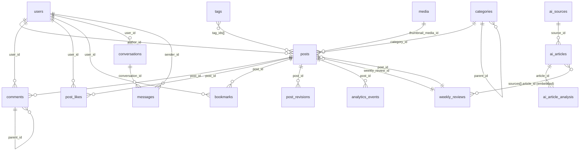

# THIẾT KẾ CƠ SỞ DỮ LIỆU MONGODB

## 0. Nguyên tắc thiết kế chung

MongoDB là document DB nên không map 1:1 kiểu bảng SQL. Các quyết định **embed** (nhúng) vs **reference** (tham chiếu ObjectId) dưới đây dựa trên 3 tiêu chí của MongoDB:

| Tiêu chí | Ưu tiên |
|---|---|
| Dữ liệu đọc cùng nhau, ít thay đổi, tập hợp bị chặn (bounded) | Embed |
| Dữ liệu tăng trưởng không giới hạn (unbounded), cần query/paginate độc lập | Reference (collection riêng) |
| Quan hệ nhiều-nhiều lớn (likes, bookmarks) | Reference + unique compound index, **không** embed trong post |
| Cần audit/log riêng, ghi liên tục (events, jobs) | Collection riêng, có index theo thời gian |

Quy ước chung áp dụng cho mọi collection:
- `_id`: ObjectId tự sinh.
- Mọi field tham chiếu đặt tên `xxx_id` kiểu `ObjectId`, không dùng populate lồng sâu quá 1 cấp ở tầng DB (join ở application layer hoặc `$lookup`).
- `created_at`, `updated_at`: `Date`, set ở application layer hoặc dùng timestamps của Mongoose.
- Counter phi chuẩn hoá (denormalized) như `likes_count`, `views_count` **luôn** cập nhật bằng `$inc` atomic, không tính lại từ đầu mỗi request — nguồn sự thật (source of truth) vẫn là collection mapping (`post_likes`, `bookmarks`) hoặc `analytics_events`.
- Validation ở DB level dùng MongoDB `$jsonSchema` (collection validator) làm lớp phòng thủ thứ hai, bên cạnh validate ở backend.
- Không bao giờ trả `password_hash` ra API — dùng `projection` loại trừ field này ở mọi query trả về client.

---

## 1. Tổng quan collections

| # | Collection | Loại quan hệ chính | Ghi chú |
|---|---|---|---|
| 1 | `users` | — | Admin (duy nhất) + User |
| 2 | `categories` | self-ref (`parent_id`) | 1 cấp ở MVP, sẵn sàng cây |
| 3 | `tags` | referenced từ `posts.tag_ids` | Không cần bảng `post_tags` riêng trong Mongo |
| 4 | `media` | referenced từ `posts`, `users.avatar` | Metadata file, không lưu binary |
| 5 | `posts` | ref `categories`, `tags`, `media`, `users`, `weekly_reviews` | Collection trung tâm |
| 6 | `post_revisions` | ref `posts` | Optional (UC02) |
| 7 | `comments` | ref `posts`, `users`, self-ref `parent_id` | |
| 8 | `post_likes` | ref `posts`, `users` | unique(post_id, user_id) |
| 9 | `bookmarks` | ref `posts`, `users` | unique(post_id, user_id) |
| 10 | `conversations` | ref `users` | |
| 11 | `messages` | ref `conversations`, `users` | Tách riêng, không embed vào conversation |
| 12 | `analytics_events` | ref `posts`, `users` (nullable) | Ứng viên cho Time Series Collection |
| 13 | `ai_sources` | — | |
| 14 | `ai_articles` | ref `ai_sources` | |
| 15 | `ai_article_analysis` | ref `ai_articles` | Nhiều version/article |
| 16 | `weekly_reviews` | ref `ai_articles` (embed mảng sources), `posts` | |
| 17 | `job_logs` | ref linh hoạt (`related_ref`) | Collector/summarize/review job |

---

## 2. Chi tiết từng collection

### 2.1 `users`
```jsonc
{
  _id: ObjectId,
  username: String,        // required, unique
  email: String,            // required, unique, lowercase
  password_hash: String,    // required, never returned to client
  role: "ADMIN" | "USER",   // required, default "USER", server-assigned only
  status: "ACTIVE" | "LOCKED", // default "ACTIVE"
  avatar_media_id: ObjectId, // ref media, nullable
  bio: String,               // nullable
  created_at: Date,
  updated_at: Date
}
```
**Index:** `{username:1} unique`, `{email:1} unique`, `{status:1}`
**Business rule áp dụng:** UC08 (hash password, role server gán), UC17 (không tự khoá Admin duy nhất — enforce ở app layer bằng cách đếm `role:"ADMIN", status:"ACTIVE"` trước khi cho lock).

---

### 2.2 `categories`
```jsonc
{
  _id: ObjectId,
  name: String,          // required
  slug: String,          // required, unique
  description: String,
  parent_id: ObjectId,   // ref categories, nullable — sẵn sàng cho cây, MVP luôn null
  status: "ACTIVE" | "INACTIVE", // default ACTIVE
  created_at: Date,
  updated_at: Date
}
```
**Index:** `{slug:1} unique`, `{parent_id:1}`, `{status:1}`
**Business rule:** UC04 — category đang dùng không hard-delete → chuyển `status:"INACTIVE"`.

---

### 2.3 `tags`
```jsonc
{
  _id: ObjectId,
  name: String,
  slug: String,     // required, unique
  created_at: Date
}
```
**Index:** `{slug:1} unique`
**Quyết định thiết kế:** Không cần collection `post_tags` trung gian như SQL. Quan hệ nhiều-nhiều Post↔Tag lưu trực tiếp bằng mảng `posts.tag_ids: [ObjectId]`. Việc "không tạo duplicate mapping" (UC05) tự động đảm bảo vì thao tác gắn tag chỉ `$addToSet` vào mảng thay vì insert dòng mới.

---

### 2.4 `media`
```jsonc
{
  _id: ObjectId,
  file_name: String,
  mime_type: String,     // validate ở backend, không tin client
  size: Number,           // bytes
  storage_key: String,    // required, unique — key trên S3/MinIO/R2/local
  url: String,
  width: Number,           // nullable
  height: Number,          // nullable
  uploaded_by: ObjectId,   // ref users
  created_at: Date
}
```
**Index:** `{storage_key:1} unique`, `{uploaded_by:1}`
**Business rule:** UC06 — không lưu binary lớn trong DB, chỉ metadata + storage key.

---

### 2.5 `posts` (collection trung tâm)
```jsonc
{
  _id: ObjectId,
  title: String,               // required
  slug: String,                 // required, unique
  excerpt: String,
  markdown_content: String,     // MVP: lưu trực tiếp DB (theo khuyến nghị mục 14)
  content_html_cache: String,   // optional, cache HTML render để giảm tải render mỗi request
  thumbnail_media_id: ObjectId, // ref media, nullable
  category_id: ObjectId,        // ref categories, required — MVP 1 category/bài
  tag_ids: [ObjectId],          // ref tags, nhiều-nhiều qua mảng
  status: "DRAFT" | "REVIEW" | "SCHEDULED" | "PUBLISHED" | "ARCHIVED", // required, default DRAFT
  author_id: ObjectId,          // ref users (Admin)
  source_type: "MANUAL" | "AI_WEEKLY_REVIEW", // default MANUAL
  weekly_review_id: ObjectId,   // ref weekly_reviews, nullable — chỉ set khi bài đến từ AI draft
  seo: {
    seo_title: String,
    seo_description: String,
    canonical: String
  },
  counters: {                   // denormalized, cập nhật bằng $inc atomic
    views: { type: Number, default: 0 },
    likes: { type: Number, default: 0 },
    bookmarks: { type: Number, default: 0 },
    comments: { type: Number, default: 0 }
  },
  published_at: Date,           // nullable
  scheduled_at: Date,           // nullable
  created_at: Date,
  updated_at: Date
}
```
**Index:**
- `{slug:1} unique`
- `{status:1, published_at:-1}` — listing public theo bài mới nhất
- `{category_id:1, status:1}`
- `{tag_ids:1}` (multikey)
- `{scheduled_at:1}` (partial index `status:"SCHEDULED"`) — cho scheduler job quét bài cần publish
- Text index: `{title:"text", excerpt:"text", markdown_content:"text"}` — MVP dùng Mongo Text Search thay Elasticsearch/Meilisearch theo đúng gợi ý mục 14

**Business rule áp dụng trực tiếp:**
- UC01: slug trùng → tự thêm hậu tố hoặc yêu cầu Admin đổi (check unique index, catch duplicate key error `E11000`).
- UC03: `PUBLISHED` mới hiển thị public → mọi query công khai **bắt buộc** filter `status:"PUBLISHED"`.
- UC07: DRAFT/REVIEW loại khỏi sitemap → sinh sitemap chỉ query `status:"PUBLISHED"`.
- UC27: liên kết `weekly_review_id` là điểm nối giữa Module D (AI) và Module A (Content), đúng "contract" mục 3.1.

---

### 2.6 `post_revisions` (optional — UC02)
```jsonc
{
  _id: ObjectId,
  post_id: ObjectId,        // ref posts
  markdown_content: String, // snapshot tại thời điểm lưu
  edited_by: ObjectId,      // ref users
  created_at: Date
}
```
**Index:** `{post_id:1, created_at:-1}`
Không bắt buộc MVP (tài liệu nói rõ "không bắt buộc triển khai cả hai" Git-based hay bảng revision) — thêm sau nếu nhóm cần version history.

---

### 2.7 `comments`
```jsonc
{
  _id: ObjectId,
  post_id: ObjectId,     // ref posts, required
  user_id: ObjectId,      // ref users, required
  parent_id: ObjectId,    // ref comments, nullable — self-reference cho reply
  content: String,        // required, giới hạn độ dài ở backend
  status: "VISIBLE" | "HIDDEN" | "DELETED", // default VISIBLE
  moderated_by: ObjectId,  // ref users, nullable
  moderated_at: Date,      // nullable
  created_at: Date,
  updated_at: Date
}
```
**Index:** `{post_id:1, status:1, created_at:1}`, `{parent_id:1}`
**Quyết định thiết kế:** Không embed comment vào `posts` vì đây là dữ liệu **unbounded** (không giới hạn), dễ vượt 16MB doc limit với bài viral. Giữ collection riêng + phân trang bằng `post_id`.
**Business rule:** UC15 — soft delete/hidden qua `status`, không hard delete để giữ lịch sử; nesting giới hạn 1–2 cấp validate ở app layer khi tạo reply (check `parent.parent_id` đã tồn tại thì chặn reply-of-reply nếu vượt giới hạn).

---

### 2.8 `post_likes`
```jsonc
{
  _id: ObjectId,
  post_id: ObjectId,  // ref posts
  user_id: ObjectId,   // ref users
  created_at: Date
}
```
**Index:** `{post_id:1, user_id:1} unique` — đảm bảo UC13 "Unique(user_id, post_id)" và xử lý idempotent (insert lỗi duplicate key → coi như đã liked).
Unlike = xoá document tương ứng, đồng thời `$inc posts.counters.likes -1`.

---

### 2.9 `bookmarks`
```jsonc
{
  _id: ObjectId,
  post_id: ObjectId,
  user_id: ObjectId,
  created_at: Date
}
```
**Index:** `{post_id:1, user_id:1} unique` (UC14).

---

### 2.10 `conversations`
```jsonc
{
  _id: ObjectId,
  user_id: ObjectId,       // ref users
  status: "OPEN" | "CLOSED", // default OPEN
  last_message_at: Date,     // denormalized để sort inbox nhanh
  created_at: Date
}
```
**Index:** `{user_id:1}`, `{status:1, last_message_at:-1}`

### 2.11 `messages`
```jsonc
{
  _id: ObjectId,
  conversation_id: ObjectId, // ref conversations
  sender_id: ObjectId,        // ref users
  sender_role: "USER" | "ADMIN",
  content: String,
  created_at: Date
}
```
**Index:** `{conversation_id:1, created_at:1}`
**Quyết định thiết kế:** Tách `messages` khỏi `conversations` (không embed mảng messages) vì hội thoại có thể dài vô hạn theo thời gian — tránh document phình to và cho phép phân trang. `conversations.last_message_at` cập nhật mỗi khi insert message mới để inbox Admin sort nhanh không cần `$lookup` + sort.

---

### 2.12 `analytics_events`
```jsonc
{
  _id: ObjectId,
  event_type: "POST_VIEW" | "SEARCH" | "LIKE" | "BOOKMARK" | "SHARE" | "COMMENT",
  post_id: ObjectId,   // nullable (SEARCH không gắn post)
  user_id: ObjectId,   // nullable — Guest không có
  session_id: String,  // nullable, dùng chống duplicate view
  metadata: Object,     // flexible, vd: {keyword: "..."} cho SEARCH
  created_at: Date
}
```
**Index:** `{post_id:1, event_type:1, created_at:-1}`, `{created_at:-1}`
**Gợi ý nâng cao:** MongoDB có **Time Series Collection** (`timeField:"created_at", metaField:"meta"`) tối ưu cho dữ liệu event ghi liên tục, nén tốt hơn collection thường — nên cân nhắc khi lượng event lớn ở Sprint 5 thay vì collection thường.
**Business rule:** UC20 — lỗi ghi analytics không được làm hỏng luồng đọc bài → gọi insert này **async/fire-and-forget**, không await trong critical path trả response.

---

### 2.13 `ai_sources`
```jsonc
{
  _id: ObjectId,
  name: String,
  type: "RSS" | "API" | "BLOG",
  url: String,
  priority: Number,       // độ ưu tiên
  trust_score: Number,     // độ tin cậy
  status: "ACTIVE" | "INACTIVE", // default ACTIVE
  created_at: Date
}
```
**Index:** `{status:1}`
Collector (UC23) chỉ query `status:"ACTIVE"`.

---

### 2.14 `ai_articles`
```jsonc
{
  _id: ObjectId,
  source_id: ObjectId,     // ref ai_sources
  title: String,
  url: String,
  canonical_url: String,    // chuẩn hoá cho dedup
  fingerprint: String,       // hash(normalized_title + canonical_url) — chống trùng
  author: String,
  published_at: Date,
  raw_summary: String,
  duplicate_of: ObjectId,    // ref ai_articles, nullable
  status: "NEW" | "PROCESSED" | "DUPLICATE" | "FAILED", // default NEW
  collected_at: Date,
  created_at: Date
}
```
**Index:** `{canonical_url:1} unique` (hoặc `{fingerprint:1} unique` nếu dùng fingerprint làm khoá chống trùng chính), `{source_id:1}`, `{status:1}`, `{published_at:-1}`
**Business rule:** UC24 — unique index trên `canonical_url`/`fingerprint` là cơ chế chống duplicate ở tầng DB; nếu insert trùng → catch lỗi và set `status:"DUPLICATE", duplicate_of:<existing_id>` thay vì tạo mới.

---

### 2.15 `ai_article_analysis`
```jsonc
{
  _id: ObjectId,
  article_id: ObjectId,   // ref ai_articles
  version: Number,          // default 1, tăng nếu chạy lại
  summary: String,
  key_points: [String],
  technologies: [String],
  companies: [String],
  opportunities: [String],
  risks: [String],
  model: String,             // tên/phiên bản AI model dùng để sinh
  status: "SUCCESS" | "FAILED",
  created_at: Date
}
```
**Index:** `{article_id:1, version:-1}`
**Quyết định thiết kế:** Tách riêng collection (không embed vào `ai_articles`) vì tài liệu ghi rõ "1 hoặc nhiều phiên bản theo article" — mỗi lần retry/regenerate tạo version mới, giữ lịch sử để so sánh, tránh mất dữ liệu khi AI trả lỗi.

---

### 2.16 `weekly_reviews`
```jsonc
{
  _id: ObjectId,
  week_start: Date,          // required
  week_end: Date,             // required
  title: String,
  excerpt: String,
  markdown_content: String,
  status: "DRAFT" | "REVIEW" | "PUBLISHED", // default REVIEW
  sources: [                  // embed — tập hợp bị chặn (bounded) trong 1 tuần, dùng để citation
    {
      article_id: ObjectId,   // ref ai_articles
      source_id: ObjectId,     // ref ai_sources
      title: String,
      url: String
    }
  ],
  topics: [                   // embed — kết quả UC26, bounded theo taxonomy cố định
    {
      topic: String,
      score: Number,
      representative_article_ids: [ObjectId]
    }
  ],
  reviewed_by: ObjectId,       // ref users, nullable
  reviewed_at: Date,            // nullable
  post_id: ObjectId,            // ref posts, nullable — set sau khi UC27/UC28 chuyển thành Post
  created_at: Date,
  updated_at: Date
}
```
**Index:** `{week_start:1} unique`, `{status:1}`
**Quyết định thiết kế:** `weekly_review_sources` (bảng mapping trong thiết kế SQL gốc) được **embed** trực tiếp thành mảng `sources` trong `weekly_reviews` — vì đây là tập hợp cố định, nhỏ, luôn đọc cùng với review, không cần query độc lập. Đây là khác biệt chính so với thiết kế quan hệ SQL (giảm 1 collection/join).
**Business rule:** UC27/UC28 — không tự chuyển `PUBLISHED`; Admin phải chủ động link sang `posts` (ghi `post_id` ở đây và `weekly_review_id` ở `posts`) rồi publish qua Module A.

---

### 2.17 `job_logs`
```jsonc
{
  _id: ObjectId,
  job_type: "COLLECT" | "DEDUP" | "SUMMARIZE" | "TREND" | "WEEKLY_DRAFT",
  status: "PENDING" | "RUNNING" | "SUCCESS" | "FAILED",
  attempt: Number,           // default 0, có giới hạn retry
  related_ref: {              // tham chiếu linh hoạt tới đối tượng liên quan
    collection: String,        // vd "ai_sources", "weekly_reviews"
    id: ObjectId
  },
  error_message: String,      // nullable
  started_at: Date,
  finished_at: Date,           // nullable
  created_at: Date
}
```
**Index:** `{job_type:1, status:1, created_at:-1}`
**Business rule:** UC29 — retry giới hạn (check `attempt` trước khi cho retry lại); idempotency đảm bảo ở tầng job xử lý (vd: COLLECT job check `ai_articles.canonical_url` trước insert, không phụ thuộc job_logs).

---

## 3. Sơ đồ quan hệ (ERD dạng Mongo — tham chiếu)



---

## 4. Bảng tổng hợp Index (checklist khi tạo migration script)

| Collection | Index | Mục đích |
|---|---|---|
| users | `{username:1}` unique, `{email:1}` unique | Uniqueness, login |
| categories | `{slug:1}` unique | URL routing |
| tags | `{slug:1}` unique | Tránh trùng tag |
| media | `{storage_key:1}` unique | Tránh trùng file |
| posts | `{slug:1}` unique, `{status:1,published_at:-1}`, `{category_id:1}`, `{tag_ids:1}`, text `{title,excerpt,markdown_content}` | Routing, listing, filter, search |
| comments | `{post_id:1,status:1,created_at:1}` | Load comment theo bài |
| post_likes | `{post_id:1,user_id:1}` unique | Chặn duplicate like |
| bookmarks | `{post_id:1,user_id:1}` unique | Chặn duplicate save |
| messages | `{conversation_id:1,created_at:1}` | Phân trang chat |
| analytics_events | `{post_id:1,event_type:1,created_at:-1}` | Dashboard/aggregate |
| ai_articles | `{canonical_url:1}` unique | Chống trùng nguồn |
| ai_article_analysis | `{article_id:1,version:-1}` | Lấy version mới nhất |
| weekly_reviews | `{week_start:1}` unique | 1 review/tuần |
| job_logs | `{job_type:1,status:1,created_at:-1}` | Theo dõi pipeline |

---

## 5. Ghi chú triển khai (khớp mục 12 – Yêu cầu phi chức năng)

- **Security:** dùng `bcrypt`/`argon2` cho `password_hash`; middleware authorization check `role` từ session/token (server-side), không tin field `role` gửi từ client; sanitize `markdown_content`/`comments.content` trước khi render HTML để chống XSS.
- **Performance:** mọi API listing dùng `limit/skip` hoặc cursor-based pagination trên index đã tạo; cache `posts` PUBLISHED read-heavy bằng Redis nếu cần ở Sprint sau.
- **Reliability:** `job_logs` + trường `attempt` cho retry có giới hạn; các thao tác insert dùng unique index để tự nhiên chống duplicate khi job chạy lại (idempotency).
- **Auditability:** `weekly_reviews.sources[]` giữ link nguồn gốc; `comments.moderated_by/moderated_at` và `users` lock action nên ghi thêm log riêng nếu nhóm có thời gian (có thể tái dùng `job_logs`-style collection `audit_logs` sau).
- **Maintainability:** thống nhất enum status (`DRAFT/REVIEW/SCHEDULED/PUBLISHED/ARCHIVED`, v.v.) thành constant dùng chung giữa 4 member trước khi code — tránh lệch string enum giữa các module.

---

## 6. Mapping với 15 entity gốc trong tài liệu (mục 11)

| Entity trong tài liệu (SQL-style) | Thiết kế MongoDB |
|---|---|
| `post_tags` (bảng trung gian) | **Bỏ** — nhúng thành `posts.tag_ids: [ObjectId]` |
| `weekly_review_sources` (bảng mapping) | **Bỏ** — nhúng thành `weekly_reviews.sources: [...]` |
| `ai_article_analysis` (1-n theo article) | Giữ collection riêng, thêm field `version` |
| `jobs/job_logs` | Gộp thành 1 collection `job_logs` với `job_type` phân loại |
| Còn lại (13 entity) | Giữ 1-1 thành collection riêng |

→ Từ 17 bảng SQL gốc còn **17 collection** nhưng thực chất đơn giản hơn vì 2 bảng trung gian (`post_tags`, `weekly_review_sources`) được loại bỏ nhờ đặc tính document-embedding của MongoDB, đổi lại có 2 collection tách để đảm bảo scalability (`post_revisions`, `messages` tách khỏi `posts`/`conversations`).